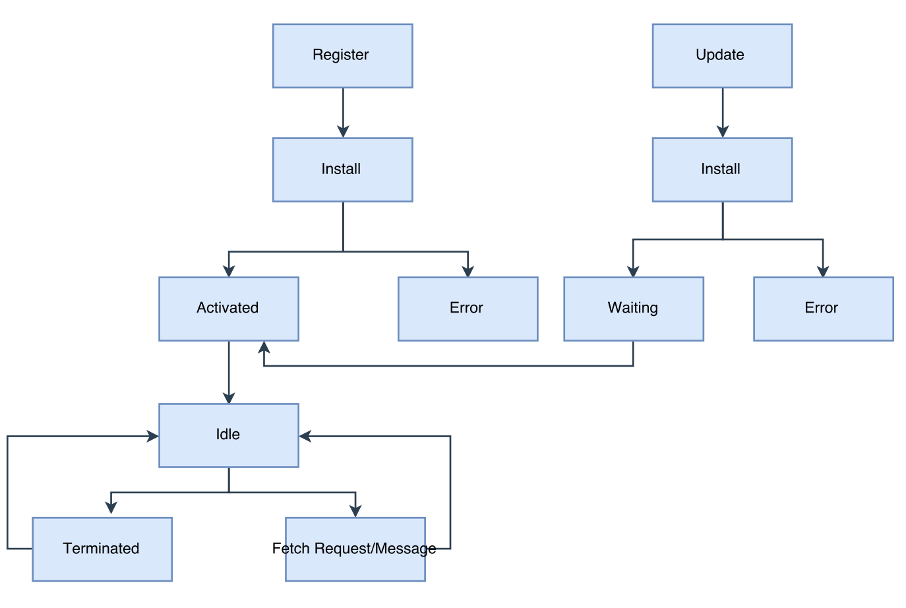

Service worker增强缓存

@(离线)[缓存策略|缓存更新|缓存淘汰]

**Service worker**是由JavaScript编写的浏览器端代理脚本，前端发起注册时，内核会用新的进程或者线程进行**安装**和**激活**操作。成功激活后便进入**空闲等待**状态，若当前的Service worker进程／线程一直没有管辖的页面或者事件消息时便会终止（所以不能在Service worker中持久化保存数据）。当管辖页面重新打开或者事件消息时将会被重新**唤起**.  

每当已安装的Service Worker有管辖页面被打开时，便会触发Service Worker脚本更新，当上次  脚本更新写入Service Worker数据库的时间戳与本次更新超过24小时，便会忽略本地网络cache的Service Worker脚本直接从网络拉取。若网络拉取的与本地有一个字节的差异都会触发Service Worker脚本的更新，更新流程与安装类似，只是在更新安装成功后不会立即进入active状态，需要等待旧版本的Service Worker进/线程终止。
 

## 先决条件
### 浏览器支持
浏览器支持是前提条件，Service worker现在除了Safari暗示[在未来会开发](https://trac.webkit.org/wiki/FiveYearPlanFall2015)外，Chrome自然不用说，Firefox 和 Opera均表示支持，Microsoft Edge 现在[表示公开支持](https://developer.microsoft.com/en-us/microsoft-edge/platform/status/serviceworker/)。可以在[PWA，准备好了吗？](https://ispwaready.toxicjohann.com/)和Jake Archibald 的[is Serviceworker ready ](https://jakearchibald.github.io/isserviceworkerready/)查看浏览器的支持程度。
###  需要HTTPS
使用Service worker，可以劫持连接、编撰以及过滤响应。 这是一个很强大的工具。可能存在中间人将其用于不良目的。 为避免这种情况，可仅在通过 HTTPS 提供的页面上注册Service worker，确保浏览器接收的用于注册Service worker脚本在整个网络传输过程中都没有被篡改。

## 缓存策略
 理解缓存策略是实现离线的第一步，存在多种缓存策略。包括仅使用
 * 仅缓存（cache only）
 * 仅使用网络（cache network）
 * 渐进式缓存（Cache, falling back to network） 
 * 速度优先（Cache & network race）
 * 渐进式缓存（Network falling back to cache）
 * 缓存优先（Cache then network）
 
### 仅使用缓存
在fetch事件中，仅去匹配资源，若匹配失败，表现出来的就是前端页面对于该 资源加载失败。这里容错性比较差，适合页面资源都是静态资源的，且不能使用不影响安装的资源预缓存.
```javascript
self.addEventListener('fetch', function(event) {
  event.respondWith(caches.match(event.request));
});
```

### 仅使用网络
所有的资源都是通过网络请求获得，没有缓存效果。
```javascript
self.addEventListener('fetch', function(event) {
  event.respondWith(fetch(event.request));
});
```

### 渐进式缓存
渐进式缓存分为Cache, falling back to network和Network falling back to cache两种策略。
#### Cache, falling back to network
这是缓存方案中最理想的方案，容错性最好，又能实现缓存。
```javascript
  self.addEventListener('fetch', function(event) {
  event.respondWith(
    caches.match(event.request).then(function(response) {
      return response || fetch(event.request);
    })
  );
});
```
#### Network falling back to cache
先网络请求，如果失败则从缓存中获得资源。缓存作为兜底的方案。
```javascript
 self.addEventListener('fetch', function(event) {
  event.respondWith(
    fetch(event.request).catch(function() {
      return caches.match(event.request);
    })
  );
});
```


### 速度优先
在fetch事件中同时发起本地缓存匹配及网络请求，谁先返回使用谁的，该方案适用于对性能要求比较高的站点，缩短了缓存优先策略中有可能缓存中没有资源再折回网络的时间消耗。
```javascript
function promiseAny(promises) {
  return new Promise((resolve, reject) => {
    promises = promises.map(p => Promise.resolve(p));
    promises.forEach(p => p.then(resolve));
    promises.reduce((a, b) => a.catch(() => b))
      .catch(() => reject(Error("All failed")));
  });
};

self.addEventListener('fetch', function(event) {
  event.respondWith(
    promiseAny([
      caches.match(event.request),
      fetch(event.request)
    ])
  );
});
```

### 缓存优先
页面发起两个请求，一个是从缓存中读取数据，另外一个是网络中请求，理想状态是先利用缓存中的数据渲染页面，等到网络请求中的数据到来时候再更新页面，同时更新缓存。这种适合UGC内容，社交媒体的timelines等要求实时更新的内容。
```javascript
var networkDataReceived = false;
var networkUpdate = fetch('/data.json').then(function(response) {
  return response.json();
}).then(function(data) {
  networkDataReceived = true;
  updatePage();
});
caches.match('/data.json').then(function(response) {
  if (!response) throw Error("");
  return response.json();
}).then(function(data) {
  if (!networkDataReceived) {
    updatePage(data);
  }
}).catch(function() {
  return networkUpdate;
}).catch(showErrorMessage).then(()=> { // todo });
```

```javascript
self.addEventListener('fetch', function(event) {
  event.respondWith(
    caches.open('service-worker-cache-site').then(function(cache) {
      return fetch(event.request).then(function(response) {
        cache.put(event.request, response.clone());
        return response;
      });
    })
  );
});
```
## 缓存更新策略
为了实现缓存效果，理想的状态是选择渐进式缓存策略中Cache, falling back to network方案，但是存在问题，如何去更新缓存呢？这里可以使用谷歌的[sw-precache](https://github.com/GoogleChrome/sw-precache)方案，将要缓存的内容在每次构建的时候根据文件内容生成hash,然后利用生成的hash值在Services worker中生成缓存和hash值的一一对应关系。每次都从网络中下载Service worker 注册的文件，便能实时更新缓存。但是用户也只有下次再打开页面时候才能看到此次下载的缓存更新文件。
## 缓存淘汰
如果使用[sw-precache](https://github.com/GoogleChrome/sw-precache)方案，可以在每次Service worker在Activated状态时根据文件内容生成的hash去删除失效的缓存文件，避免缓存过多。目前仍不清楚支持多少的文件缓存。
## 跨域支持
浏览器默认对跨域资源发起的是ncors请求，也就是得到的response是opaque的，Service Worker是无法获得该response的status及url信息，以至于该response是否成功不得而知。如果对跨域资源能够发起cors请求，在跨域服务器允许的情况下，得到部分属性status及url可见的response，就可以判断出跨域请求是否成功，是否可以进行缓存。
* 首先保证跨域的资源来自安全的https地址,因为你的页面已经是HTTPS了，安全策略不能降级。

* 保证跨域资源服务器的response中Access-Control-Allow-Origin中包含当前的页面所在域或者为*.
* 对于前端页面中的跨域资源的url可以附带标志位，以便Service Worker在拦截之后可以判断出是跨域请求从而重新进行组装cors请求
## 可能的坑

